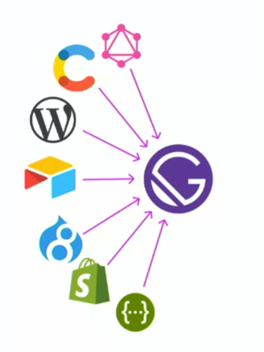

This is basically an outline of the [Intro to Gatsby Course](https://frontendmasters.com/courses/gatsby/) on Front End Masters with Jason Lengstorf. I really enjoy using Gatsby and this course helped me better understand the fundamentals. Using Gatsby might seem complicated at first especially if you've never used React or GraphQL, but I really liked how Jason explains the basics and gets you started building your first blog site using this technology.

Overview:

- What [Gatsby](https://www.gatsbyjs.org/) is and why it matters
- Gatsby fundamentals
- What [GraphQL](https://graphql.org/) is and how to use it
- What [MDX](https://mdxjs.com/) is and what it means for our content
- Programmatic page creation
- Image optimization & other performance strategies
- How to use third-party data in Gatsby sites
- How to build and deploy a Gatsby site to [Netlify](https://www.netlify.com/)

### What are the challenges of modern web development?

- Getting started is overwhelming
- The way we manage data is evolving
- Getting it right is hard

### What is Gatsby?

> Gatsby is a free and open source framework based on React that helps developers build blazing fast websites and apps

Most workflows involve a lot of boilerplate to get started, but Gatsby removes a lot of the boilerplate to make deploying to production as seamless as possible. Gatsby allows you to pull in data from all types of sources, so it makes it really versatile and can be used to build many different types of apps or websites. You can use different tools for what they are best at instead of trying to manipulate a tool into doing something it wasn't necessarily built for (example Wordpress as e-commerce platform).



Since most of the config is taken care of automatically, this lets us start writing code as soon as possible. After writing all of your code and your site is ready for deploy to production, Gatsby provides you with a build command that will do a whole bunch of optimization and convert your application into static files that can be pushed to any server. This is a big part of what makes Gatsby sites so fast without you having to do a lot of the tedious work behind the scenes.

#### Gatsby uses the right defaults under the hood...

- Follows the [PRPL pattern](https://developers.google.com/web/fundamentals/performance/prpl-pattern/) and other performance best practices
- Code splitting and prefetching out of the box
- Generates only static assets (no server required)
- Optimizes and lazy-loads assets
- Normalizes third-party data

**... but developers keep control.**

- [Webpack](https://webpack.js.org/) and [Babel](https://babeljs.io/) are fully customizable through Gatsby APIs
- Customize only what you need - no ejection required (ejections can be a pain)

## Setting up a Gatsby Site

Gatsby has what's known as a [Starter Library](https://www.gatsbyjs.org/starters/?v=2) which has over 200 hundred different "Gatsby Starters" to choose from. I like to think of Starters as kind of similar to a WordPress Theme, they give you a foundation to build upon so you don't have to start from scratch. Each starter comes packed with plugins designed to solve specific problems. There is a starter for some of the more common types of sites you may want to build including a "Gatsby Blog Starter" or a starter that will help you build a custom headless WordPress site, the possibilities are endless and you can even develop your own starters for other people to use which is really cool!

```
gatsby new gatsby-starter-blog https://github.com/gatsbyjs/gatsby-starter-blog
```

Using a starter is as simple as the line of code you see above, this one specifically is the [blog starter](https://www.gatsbyjs.org/starters/gatsbyjs/gatsby-starter-blog/s) by Kyle Mathews (founder of Gatsby) which was used to build this site you're on right now. Once you've installed your starter you are able to start typing code and see the changes in your browser instantly. Gatsby provides you with a few scripts in your package.json file including a develop script `npm run develop` that will start up a local dev environment and allow you to access your site at localhost:8000.

Inside of your Gatsby project, it's likely you will see a folder structure similar to the one below:

```
/
|-- /.cache
|-- /plugins
|-- /public
|-- /src
    |-- /pages
        |-- 404.js
        |-- index.js
    |-- /templates
    |-- /components
|-- /static
|-- gatsby-config.js
|-- gatsby-node.js
|-- gatsby-ssr.js
|-- gatsby-browser.js
```

The **src** folder is where you will spend the majority of your time, building out the pages and components for your website or application.

### Creating a New Page

After you've chosen a starter or even if you decided to build your Gatsby project from scratch, Gatsby will build a folder structure for you that includes everything you need to start creating your website. Depending on which starter you choose, Gatsby will install all of the dependencies that will be needed, and it will create a **package.json** with the list of dependencies, and some starter scripts to get you writing code as soon as possible.

Gatsby makes creating new pages super easy and simple, by automatically turning React components in the `src/pages` folder into pages with unique URLs. For example, a component located at `src/pages/contact.js` would create a page from that filename.

```jsx
const Page = () => <p>I am a Gatsby page!</p>
```

## Gatsby Link

Because we are loading a PWA, we have the ability to use dynamic routing so we don't have to reload the page every time we click a link. Gatsby comes pre packed with [Reach Router](https://reach.tech/router). Gatsby Link is a wrapper around Reach Router that will do a couple extra things like pre-loading, and we can use it in our apps by importing Link from Gatsby.

```jsx
import { Link } from "gatsby"

const Page = () => <Link to="/">Home</Link>
```

### Adding CSS with Emotion

Gatsby is really flexible when it comes to styling your apps. You can use regular css files, css modules and any of the CSS in JS solutions. There is no right or wrong answer and it essentially comes down to personal preference. For this article i'll be writing about [Emotion](https://emotion.sh/docs/introduction) which is a CSS in JS Library.

```jsx
import React from "react"
import { Global, css } from "@emotion/core"

const Layout = ({ children }) => (
  <>
    <Global
      styles={css`
        /* all of these styles will be globally available to our app */
      `}
    />
    <header></header>
    <main
      css={css`
        /* individual tag styles */
      `}
    >
      {children}
    </main>
  </>
)

export default Layout
```

In the code above we are using a component from the emotion library called "Global". To use the Global component you will use a self closing component named Global with a prop named styles which you set equal to an object and in the object you can write your global styles in a pair of back-ticks prepended with 'css'. The Global component allows us to write css styles that will be available globally to our entire application, rather than scoped to individual components which we will talk about more in a minute.

A way to add styles to individual html tags is to give the tag an attribute named css set equal to an object, and similar to the Global component we can put back-ticks prepended with css and write our styles inside the back-ticks.

**Styled Component**

One of my favorite things about Emotion is the ability to create "Styled Components", which is not to be confused with another CSS in JS library called "Styled Components" but it was actually inspired by the library. To create a styled component you can call styled with a template literal for string styles or a regular function call for object styles. Styled is capable of styling any component as long as it accepts a className prop.

```jsx
const StyledLink = styled(Link)`
  color: #222;
`

const Header = () => (
  <header>
    <nav>
      <StyledLink to="/">Styled Link</StyledLink>
    </nav>
  </header>
)

export default Header
```

One of my favorite things about creating styled components is that it enables us to set our styles based on the props of our components. This feature makes it really easy to do cool things like passing in a darkMode prop or something like that, you can get really creative and produce dynamic styles for your app.

```jsx
const Button = styled.button`
  color: ${props => (props.primary ? "lime" : "plum")};
`
```

### Styling the Active Link

Gatsby provides you with a prop on your Link components called activeClassName and you can pass it any name you want that can be used in your styles to style the active link depending which page you are on.

```jsx
const NavLink = styled(Link)`
  &.current-page {
    border-bottom: 2px solid #222;
  }

  font-weight: ${props => props.fontWeight || normal};
`

<NavLink to="/about" activeClassName="current-page" fontWeight="bold">
  About
</NavLink>
```

## Gatsby & GraphQL

Another cool thing about Gatsby is how it pulls data into your website or application which is by using GraphQL. GraphQL was developed by Facebook around 2012, it is a data query and manipulation language and a runtime for fulfilling queries with existing data. One really nice thing about using GraphQL with Gatsby is that we get to use the GraphQL Playground, an in-browser IDE that allows us to interact with our data and schema.

Above you can see how we use the Playground to interact with our siteMetaData that we set up in our gatsby-config.js file. The Playground is a really nice interface that makes it easy to test our queries that we are going to use in our application.

To actually use our siteMetadata in the <head> tag of our application we need to install another couple of plugins called gatsby-plugin-react-helmet and react-helmet. React Helmet is a library that makes it so we can modify the head in our html document, so we can use this to set the title, metadata and a whole bunch of other things on our site.

The easiest way to use our data inside one of our pages is to use the useStaticQuery and graphql modules provided by Gatsby. Inside of our component we can declare a static query and then we can use that data in the returned component. This is a really nice workflow for throwing data around within our application.

```jsx
var { site } = useStaticQuery(
  graphql
    query {
      site {
        siteMetadata {
          title
          description
          author
        }
      }
    }

)

<Helmet>
  <html lang="en" />
  <title>{site.siteMetadata.title || "title"}</title>
  <meta name="description" content="site description" />
</Helmet>
```

## Rendering Components in MDX

To render mdx in Gatsby we need to install another plugin named gatsby-plugin-mdx. We also need to install @mdx-js/mdx and @mdx-js/react. If you don't know what [mdx](https://mdxjs.com/) is, it's basically markdown that works well with React by letting you import components.

After installing those packages from npm all you need to do is tell your Gatsby config file about your gatsby-plugin-mdx plugin and write an .mdx file in your pages folder! Gatsby makes it really easy to use plugins and this is what I love about the Gatsby ecosystem so much is that you can bring in specialized tools to do specific things in your app that you want to accomplish.

## Building a Blog with MDX

We can set up a special posts folder that we can use to store all of our blog posts in separate folders. It doesn't necessarily matter where the posts folder is located. In markdown we have something called front matter which is content that isn't printed to the page, but data we can use elsewhere like the title, slug, and author of the post.

```mdx
---
title: Hello I am front-matter title
slug: hello-world-mdx-blog-post
author: Tanner Hoffman
---

#This is my first blog post. I wrote it in MDX.
```

How do we get our mdx files into pages on our website? We need to install another plugin called gatsby-source-filesystem. After we install the plugin we need to configure it in our gatsby config file.

```javascript
module.exports = {
  siteMetadata: {
    title: `Site title`,
    author: `@TannerHoffman`,
  },
  plugins: [
    {
      resolve: "gatsby-source-filesystem",
      options: {
        name: "posts",
        path: "posts",
      },
    },
  ],
}
```

After a very simple set-up our mdx posts our now available in our GraphQL schema.


GraphQL Playground

### Generating Post Pages Programmatically (work on this section)

We need to create a new file called gatsby-node.js.

## ⭐️⚡️🔥 Working with Images

```terminal
npm install gatsby-transformer-sharp gatsby-plugin-sharp gatsby-background-image
```

- images in front matter for blog
- fluid images
- fluid image sharp/ transformer sharp
- gatsby image - same as gatsby background image, but for regular images.

Because Gatsby recognized that we were pointing to an image in our frontmatter, the transformer knows to make the transformatoins and give us the options of optimization.

- In order to use gatsby images on our mdx posts, we need to install one more plugin that will help us.

  npm install gatsby-remark-images

[](https://www.gatsbyjs.org/packages/gatsby-remark-images/)

Next you will have to add some configuration to gatsby-plugin-mdx inside the gatsby-config.js file.

```javascript
{
  resolve: 'gatsby-plugin-mdx',
  options: {
    defaultLayouts: {
      default: require.resolve('./src/components/layout.js'),
    },
    gatsbyRemarkPlugins: [{ resolve: 'gatsby-remark-images' }],
    plugins: [{ resolve: 'gatsby-remark-images' }],
  },
},
```

Even though we have huge images Gatsby is taking care of a lot of work by optimizing and giving us all types of options for using our images in the most efficient ways. Gatsby image is capable of doing so much cool stuff it's really worth checking out and learning how to use.

[.css-12rod3i{[object Object];}Using Gatsby Image](https://using-gatsby-image.gatsbyjs.org/traced-svg/)

## 3rd Party Data

**Instagram Source Plugin Setup**

The Gatsby ecosystem is full of all types of source plugins that help you pull in data from 3rd party sources.

    npm install gatsby-source-instagram

After we npm install the instagram souce plugin we need to do a little bit of work in our config file so gatsby knows that we want to use it. Below you can see it's a simple set up inside the options object we just need to identify the username of the instagram account that we want to pull data from.

```javascript
{
  resolve: 'gatsby-source-instagram',
  options: {
    username: 'hoff.man_',
  },
},
```

## Getting the Instagram Data

To retrieve the data from our instagram source and display it in our app we are going to create another hook in our hooks file. We will need to import graphql, and useStaticQuery from gatsby to help us get the data. We can `useStaticQuery()` and save the data we want into a variable called data, then we can map through the nodes that we queried and map through them so we can return an object of all the properties we want from each node.

```jsx
import { graphql, useStaticQuery } from "gatsby"

const useInstagram = () => {
  const data = useStaticQuery(graphql`
    query {
      allInstaNode(limit: 12) {
        nodes {
          likes
          id
          username
          localFile {
            childImageSharp {
              fluid(maxWidth: 120, maxHeight: 120) {
                ...GatsbyImageSharpFluid_withWebp
              }
            }
          }
        }
      }
    }
  `)
  return data.allInstaNode.nodes.map(node => ({
    ...node.localFile.childImageSharp, // array of pho
    id: node.id,
    caption: node.caption,
    username: node.username,
  }))
}

export default useInstagram
```

Now we can import this hook into our instagram component and call useData() inside of our component so we can access the data we want to display on our app.
