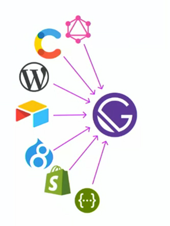
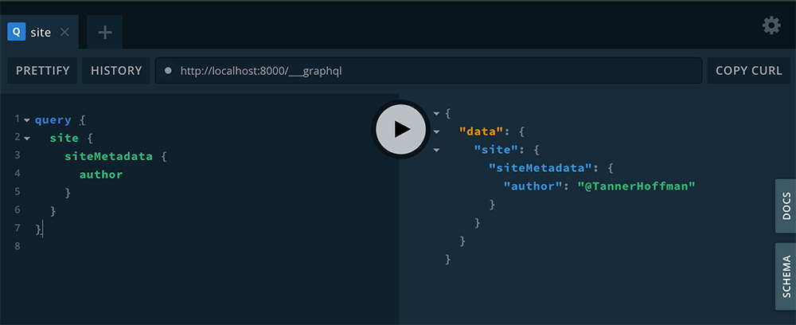
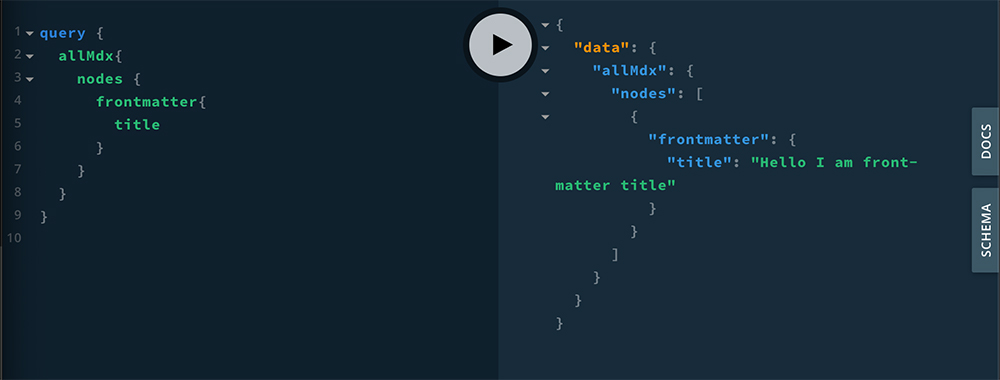

This is basically an outline of the [Intro to Gatsby Course](https://frontendmasters.com/courses/gatsby/ "Gatsby Course on Front End Masters") on Front End Masters with Jason Lengstorf. I really enjoy using Gatsby and this course helped me better understand the fundamentals. Using Gatsby might seem complicated at first especially if you've never used React or GraphQL, but I really liked how Jason explains the basics and gets you started building your first blog site using this technology.

This article won't go into too much detail about all of the features of Gatsby, but hopefully it will be a nice overview and give you an idea of what Gatsby is and what it can do.

Overview:

- What [Gatsby](https://www.gatsbyjs.org/ "Gatsby Website") is and why it matters
- Gatsby fundamentals
- What [GraphQL](https://graphql.org/ "GraphQL Website") is and how to use it
- What [MDX](https://mdxjs.com/ "MDX website") is and what it means for our content
- Programmatic page creation
- Image optimization & other performance strategies
- How to use third-party data in Gatsby sites
- How to build and deploy a Gatsby site to [Netlify](https://www.netlify.com/ "Netlify Website")

### What are the challenges of modern web development?

- Getting started is overwhelming
- The way we manage data is evolving
- Getting it right is hard

### What is Gatsby?

> Gatsby is a free and open source framework based on React that helps developers build blazing fast websites and apps

Most workflows involve a lot of boilerplate to get started, but Gatsby removes a lot of the boilerplate to make deploying to production as seamless as possible. Gatsby allows you to pull in data from all types of sources, so it makes it really versatile and can be used to build many different types of apps or websites. You can use different tools for what they are best at instead of trying to manipulate a tool into doing something it wasn't necessarily built for (example Wordpress as e-commerce platform).



Since most of the config is taken care of automatically, this lets us start writing code as soon as possible. After writing all of your code and your site is ready for deploy to production, Gatsby provides you with a build command that will do a whole bunch of optimization and convert your application into static files that can be pushed to any server. This is a big part of what makes Gatsby sites so fast without you having to do a lot of the tedious work behind the scenes.

#### Gatsby uses the right defaults under the hood...

- Follows the [PRPL pattern](https://developers.google.com/web/fundamentals/performance/prpl-pattern/ "PRPL pattern") and other performance best practices
- Code splitting and prefetching out of the box
- Generates only static assets (no server required)
- Optimizes and lazy-loads assets
- Normalizes third-party data

**... but developers keep control.**

- [Webpack](https://webpack.js.org/ "Webpack Website") and [Babel](https://babeljs.io/ "Babel Website") are fully customizable through Gatsby APIs
- Customize only what you need - no ejection required (ejections can be a pain)

## Setting up a Gatsby Site

Gatsby has what's known as a [Starter Library](https://www.gatsbyjs.org/starters/?v=2 "Gatsby Starter Library") which has over 200 hundred different "Gatsby Starters" to choose from. I like to think of Starters as kind of similar to a WordPress Theme, they give you a foundation to build upon so you don't have to start from scratch. Each starter comes packed with plugins designed to solve specific problems. There is a starter for some of the more common types of sites you may want to build including a "Gatsby Blog Starter" or a starter that will help you build a custom headless WordPress site, the possibilities are endless and you can even develop your own starters for other people to use which is really cool!

```
gatsby new gatsby-starter-blog https://github.com/gatsbyjs/gatsby-starter-blog
```

Using a starter is as simple as the line of code you see above, this one specifically is the [blog starter](https://www.gatsbyjs.org/starters/gatsbyjs/gatsby-starter-blog/s "Gatsby Blog Starter") by Kyle Mathews (founder of Gatsby) which was used to build this site you're on right now. Once you've installed your starter you are able to start typing code and see the changes in your browser immediately. Gatsby provides you with a few scripts in your <span class='hl-purple'>package.json</span> file including a develop script <span class='hl-purple'>npm run develop</span> that will start up a local dev environment and allow you to access your site on a local host.

Inside of your Gatsby project, it's likely you will see a folder structure similar to the one below:

```
/
|-- /.cache
|-- /plugins
|-- /public
|-- /src
    |-- /pages
        |-- 404.js
        |-- index.js
    |-- /templates
    |-- /components
|-- /static
|-- gatsby-config.js
|-- gatsby-node.js
|-- gatsby-ssr.js
|-- gatsby-browser.js
```

The <span class='hl-purple'>**src**</span> folder is where you will spend the majority of your time, building out the pages and components for your website or application.

### Creating a New Page

Gatsby makes creating new pages super easy and simple by automatically turning React components in the <span class='hl-purple'>src/pages</span> folder into pages with unique URLs. For example, a component located at <span class='hl-purple'>src/pages/contact.js</span> would create a page from that filename. I find being able to write React components to build a website or app really enjoyable, and Gatsby makes this workflow even better by helping with a lot of the "not so fun" work so I can start writing code basically instantly with very little configuration.

```jsx
import React from "react"

const Page = () => <p>I am a Gatsby page!</p>

export default Page
```

### Gatsby Link

Because we are loading a PWA ([progressive web app](https://en.wikipedia.org/wiki/Progressive_web_applications "progressive web app definition")), we have the ability to use dynamic routing which makes it so we don't have to reload the page every time we click an internal link. This feature makes the site feel super fast and seamless compared to the big flash of a blank screen that you normally get when navigating between pages. Gatsby comes pre packed with [Reach Router](https://reach.tech/router "Reach Router Website"). Gatsby provides something called [Gatsby Link](https://www.gatsbyjs.org/docs/gatsby-link/s "Gatsby Website") which is basically a wrapper around Reach Router that will do a couple extra things like pre-loading, and we can use it in our apps by importing Link from Gatsby.

The Gatsby Link API is really simple to use for internal navigation. All you have to do is write the Link component imported from Gatsby and provide it with a <span class='hl-purple'>**to**</span> prop equal to the path in your application that you want to link to. The Link component also has more advanced capabilities such as programmatic navigation and more that you can read about [here](https://www.gatsbyjs.org/docs/gatsby-link/ "Gatsby Link API documentation").

```jsx
import { Link } from "gatsby"

const Nav = () => (
  <nav>
    <Link to="/">Home</Link>
    <Link to="/about">About</Link>
  </nav>
)

export default Nav
```

## 👩‍🎤 Adding CSS with Emotion JS

Gatsby is really flexible when it comes to adding styles to your app. You can use regular globally scoped css files, css modules and any of the CSS in JS solutions which are my personal favorite. There is no right or wrong answer and it essentially comes down to personal preference. For this article i'll be writing about [Emotion](https://emotion.sh/docs/introduction "Emotion Website") which is basically a tool that allows you to write css styles with JavaScript.

Cool things about Emotion:

1. SSR out of the box
2. Theming
3. Great developer experience
4. Styles can be scoped to a component which can help avoid specificity issues

There are many ways to add styles to your app with Emotion. The primary way is by using the <span class='hl-purple'>css</span> prop. Any element that accepts a <span class='hl-purple'>className</span> prop is also capable of using the <span class='hl-purple'>css</span> prop provided by Emotion. The <span class='hl-purple'>css</span> prop can accept a tagged template literal like the code shown below. In order to use the <span class='hl-purple'>css</span> prop it first needs to be imported by <span class='hl-purple'>@emotion/core</span>.

```jsx
import { css } from "@emotion/core"

const Styled = () => (
  <div
    css={css`
      border: "pink";
      background: ${darkMode ? "black" : "white"};
    `}
  >
    styled div
  </div>
)

export default Styled
```

### Global Styles with Emotion

In the code below we are using a component from the emotion library called "Global". You will provide the **Global** component with a styles prop which you set equal to curly brackets where inside you can write your global styles in a pair of back-ticks prepended with 'css'. The Global component allows us to write css styles that will be available to our entire application, rather than scoped to individual components which we will talk about more in a minute.

```jsx
import React from "react"
import { Global, css } from "@emotion/core"

const Layout = ({ children }) => (
  <>
    <Global
      styles={css`
        /* all of these styles will be globally available to our app */
      `}
    />
    <header></header>
    <main
      css={css`
        /* individual tag styles */
      `}
    >
      {children}
    </main>
  </>
)

export default Layout
```

### Styled Components 💅

One of my favorite things about Emotion is the ability to create "Styled Components", which is not to be confused with another CSS in JS library called "Styled Components" but it was actually inspired by the library. To create a styled component you can call styled with a template literal for string styles or a regular function call for object styles. Styled is capable of styling any component as long as it accepts a className prop.

```jsx
import styled from "@emotion/styled"

const StyledLink = styled(Link)`
  color: #222;
`

const Nav = () => (
  <nav>
    <StyledLink to="/">Styled Link</StyledLink>
  </nav>
)

export default Nav
```

A really cool thing about creating styled components is that it enables us to set our styles based on the props of our components. This feature makes it really easy to do cool things like passing in a darkMode prop or something like that, you can get really creative and produce dynamic styles for your app.

```jsx
const Button = styled.button`
  color: ${props => (props.primary ? "lime" : "plum")};
`
```

#### Styling the Active Link

Gatsby provides you with a prop on your Link components called activeClassName and you can pass it any name you want that can be used in your styles to style the active link depending which page you are on.

```jsx
const NavLink = styled(Link)`
  &.current-page {
    border-bottom: 2px solid #222;
  }

  font-weight: ${props => props.fontWeight || normal};
`

<NavLink to="/about" activeClassName="current-page" fontWeight="bold">
  About
</NavLink>
```

## Gatsby & GraphQL

One thing I really enjoy about Gatsby is how it pulls data into your website or application by using GraphQL. GraphQL was developed by Facebook around 2012, and it's a data query and manipulation language and a runtime for fulfilling queries with existing data. One really nice thing about using GraphQL with Gatsby is that we get to use the GraphQL Playground, an in-browser IDE that allows us to interact with our data and schema.

For example it's a common practice in Gatsby to set up your site metadata inside your gatsby.config file. This enables us query data such as our site title, wherever we want on our applications which is really nice.

```javascript
module.exports = {
  siteMetadata: {
    title: `Tanner Hoffman`,
    author: `Tanner Hoffman`,
    description: `Site metadata description`,
    siteUrl: `https://gatsby-starter-blog-demo.netlify.com/`,
    social: {
      twitter: `tannerHoffman_`,
    },
  },
}
```

Below you can see how we use GraphQL and the Playground to interact with our <span className='hl-pink'>siteMetaData</span> that we set up in our gatsby-config.js file. The Playground is a really nice interface that makes it easy to test our queries that we are going to use in our application.



To actually use our <span class='hl-purple'>siteMetadata</span> in the head tag of our application we need to install another couple of plugins called <span class='hl-purple'>gatsby-plugin-react-helmet</span> and <span class='hl-purple'>react-helmet</span>. React Helmet is a library that makes it so we can modify the head in our html document, so we can use this to set the title, metadata and a whole bunch of other things on our site.

The easiest way to use our data inside one of our pages is to use the <span class='hl-purple'>useStaticQuery</span> and <span class='hl-purple'>graphql</span> modules provided by Gatsby. Inside of our component we can declare a static query and then we can use that data in the returned component. This is a really nice workflow for throwing data around within our application.

```jsx
var { site } = useStaticQuery(
  graphql
    query {
      site {
        siteMetadata {
          title
          description
          author
        }
      }
    }
);

<Helmet>
  <html lang="en" />
  <title>{site.siteMetadata.title || "title"}</title>
  <meta name="description" content="site description" />
</Helmet>
```

## Gatsby & MDX

If you don't know what [mdx](https://mdxjs.com/ "MDX Website") is, it's basically markdown that works well with React by letting you import components. To render mdx in Gatsby we need to install another plugin named <span class='hl-purple'>gatsby-plugin-mdx</span>. We also need to install <span class='hl-purple'>@mdx-js/mdx</span> and <span class='hl-purple'>@mdx-js/react</span>.

```
npm install gatsby-plugin-mdx @mdx-js/mdx @mdx-js/react
```

After installing those packages from npm all you need to do is tell your Gatsby config file about your gatsby-plugin-mdx plugin and write an .mdx file in your pages folder! We are going to set up an defaultLayouts option so we can tell mdx what layout we want to use for our mdx pages. In this case we are going to use our layout component at <span class='hl-purple'>./src/components/layout.js</span>. Now any mdx files that we load will be rendered through our layout component which is really nice.

```javascript
modules.export = {
  plugins: [
    {
      resolve: "gatsby-plugin-mdx",
      options: {
        defaultLayouts: {
          default: require.resolve("./src/components/layout.js"),
        },
        gatsbyRemarkPlugins: [{ resolve: "gatsby-remark-images" }],
        plugins: [{ resolve: "gatsby-remark-images" }],
      },
    },
  ],
}
```

The primary benefit of using mdx is the ability to import React components to add interactive functionality or dynamic data to your markdown posts.

```mdx
import Graph from "../components/graph"

#Cool Graph

You will see above that I imported a React component. Below I will put it to action.

<Graph />

Writing components in my markdown files is awesome! I love mdx.
```

Gatsby makes it really easy to use plugins and this is what I love about the Gatsby ecosystem so much is that you can bring in specialized tools to do specific things in your app that you want to accomplish. Check out the Gatsby Plugin [Library](https://www.gatsbyjs.org/plugins/ "Gatsby Plugin Library").

### Building a Blog with MDX

First we need to do some set up so we can start writing our blog <span class='hl-purple'>mdx</span> files. It doesn't necessarily matter where the posts folder is located. Each blog post will have a separate folder inside of the <span class='hl-purple'>posts</span> folder to hold the mdx file and all the images associated with that post.

Now we are ready to start writing our <span class='hl-purple'>mdx</span> files. In markdown we have something called front matter which is content that isn't printed to the page, but data that we can use elsewhere like the <span class='hl-purple'>title</span>, <span class='hl-purple'>slug</span>, and <span class='hl-purple'>author</span> of the post.

```mdx
---
title: Hello I am front-matter title
slug: hello-world-mdx-blog-post
author: Tanner Hoffman
---

#This is my first blog post. I wrote it in MDX.

See those first three lines between the --- things?
That is what we call frontmatter.
```

How do we turn our mdx files into pages on our website? We need to install another plugin called <span class='hl-purple'>gatsby-source-filesystem</span>. After we install the plugin we need to configure it in our gatsby config file. You should learn more about [gatsby-source-filesystem](https://www.gatsbyjs.org/packages/gatsby-source-filesystem/ "gatsby-source-filesystem documentation") on the Gatsby documentation.

```
npm install gatsby-source-filesystem
```

```javascript
module.exports = {
  siteMetadata: {
    title: `Site title`,
    author: `@TannerHoffman`,
  },
  plugins: [
    {
      resolve: "gatsby-source-filesystem",
      options: {
        name: "posts",
        path: "posts",
      },
    },
  ],
}
```

After a very simple set-up our mdx posts our now available in our GraphQL schema which we can check out on the GraphQL Playground which is one of the biggest reasons I enjoy using GraphQL.



#### Rendering a Post

We are going to use a custom hook to render our posts that we call <span class='hl-purple'>usePosts()</span>. The hook will need to import <span class='hl-purple'>useStaticQuery</span> and <span class='hl-purple'>graphql</span> from gatsby so we can query our mdx data to render our blog posts. I suggest you read more about querying data in components with the <span class='hl-purple'>useStaticQuery</span> hook in the [Gatsby Docs](https://www.gatsbyjs.org/docs/use-static-query/ "useStaticQuery documentation").

```jsx
import { graphql, useStaticQuery } from "gatsby"

const usePosts = () => {
  const data = useStaticQuery(graphql`
    query {
      allMdx {
        nodes {
          frontmatter {
            title
            slug
            author
              }
            }
          }
          excerpt
        }
      }
    }
  `)

  return data.allMdx.nodes.map(post => ({
    title: post.frontmatter.title,
    slug: post.frontmatter.slug,
    author: post.frontmatter.author,
    excerpt: post.excerpt,
  }))
}

export default usePosts
```

Now on our home page we are able to import this hook and use it to retrieve the data we need to display our blog posts on <span class='hl-purple'>index.js</span>. Below you will see a <span class='hl-purple'>PostPreview</span> component that is basically just taking the individual post as a prop so it can return the data in some nicely formatted jsx, into the list of posts on the index page. So essentially we are looping through all of the mdx blog posts we wrote, and creating a list of links that we can use to navigate to each individual post.

```jsx
import Layout from "../components/Layout"
import usePosts from "../hooks/use-posts"

import { Link } from "gatsby"

export default () => {
  const posts = usePosts()
  return (
    <>
      <Layout>
        <h2>hey shit head</h2>
        {posts.map(post => (
          <PostPreview key={post.slug} post={post} />
          <pre>{JSON.stringify(post, null, 2)}</pre>
        ))}
      </Layout>
    </>
  )
}
```

The ability to create these hooks and being able to re-use their functionality all over your app is really powerful. These static query hooks can be used in any component or page.

### Generating Post Pages Programmatically

finish this section!

We need to create a new file called gatsby-node.js.

## ⭐️⚡️🔥 Working with Images

```
npm install gatsby-transformer-sharp gatsby-plugin-sharp gatsby-background-image
```

- images in front matter for blog
- fluid images
- fluid image sharp/ transformer sharp
- gatsby image - same as gatsby background image, but for regular images.

Because Gatsby recognized that we were pointing to an image in our frontmatter, the transformer knows to make the transformatoins and give us the options of optimization.

- In order to use gatsby images on our mdx posts, we need to install one more plugin that will help us.

  npm install gatsby-remark-images

[Gatsby Remark](https://www.gatsbyjs.org/packages/gatsby-remark-images/ "Gatsby Remark Images documentation")

Next you will have to add some configuration to gatsby-plugin-mdx inside the gatsby-config.js file.

```javascript
{
  resolve: 'gatsby-plugin-mdx',
  options: {
    defaultLayouts: {
      default: require.resolve('./src/components/layout.js'),
    },
    gatsbyRemarkPlugins: [{ resolve: 'gatsby-remark-images' }],
    plugins: [{ resolve: 'gatsby-remark-images' }],
  },
},
```

Even though we have huge images Gatsby is taking care of a lot of work by optimizing and giving us all types of options for using our images in the most efficient ways. Gatsby image is capable of doing so much cool stuff it's really worth checking out and learning how to use.

[Using Gatsby Image](https://using-gatsby-image.gatsbyjs.org/traced-svg/ "Gatsby Image API")

## 3rd Party Data

The Gatsby course on FEM had a really cool section about pulling in 3rd party data from instagram, but i'm not going to go over that in detail, or really at all. So if you want to learn more about that, again I highly recommend taking the course! Or if you don't want to take the course you can learn more about third-party data on [Gatsby](https://www.gatsbyjs.org/docs/third-party-graphql/ "Gatsby third-party data documentation").

### Conclusion

Thats it! Hopefully you now have a pretty good understanding of what it will take to get your first Gatsby site and blog up and running. I highly suggest taking the [Gatsby course](https://frontendmasters.com/courses/gatsby/ "Gatsby course on Front End Masters") on Front End Masters if you want to dive a little deeper and learn from [Jason Lengstorf](https://www.gatsbyjs.org/contributors/jason-lengstorf/ "Jason Lengstorf on Gatsby site") who is actually on the Gatsby team! I really enjoyed the course and it made me love using Gatsby even more than I used to!
